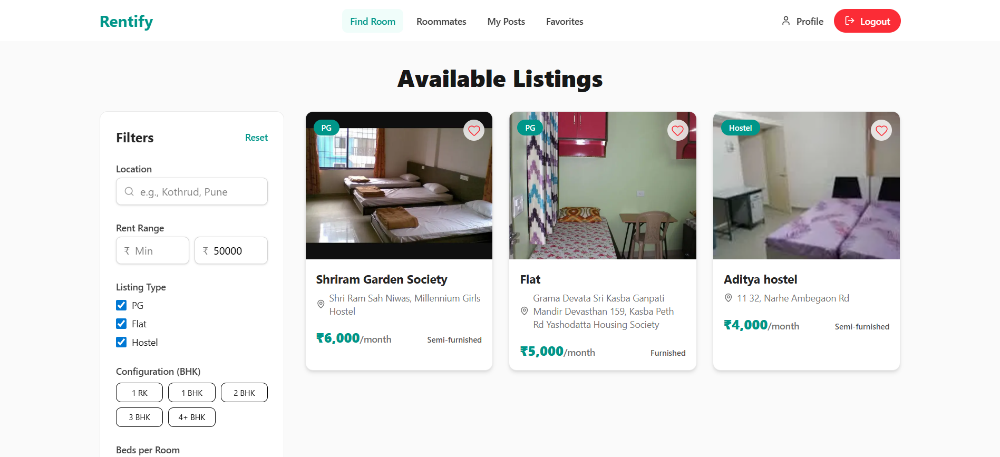

# 🏠 Rentify

Rentify is a modern **rental listing platform** built with [Next.js](https://nextjs.org), designed to help users find flats, PGs, and roommates easily.  
It provides a clean UI, real-time updates, and integration with a backend database for smooth listing and search experiences.

---

## 🚀 Features

- 📌 Create and publish rental listings (Flats / PGs / Roommates)
- 🗺️ Location support with Google Maps integration
- 👤 User authentication & profile management
- 🔎 Advanced search and filters
- ⚡ Built using **Next.js App Router** for fast navigation
- 🎨 Styled with **TailwindCSS** and icons via **lucide-react**
- 🗄️ MongoDB integration for listings and users

---

## 🖼️ Screenshots

_Add your screenshots here for better visibility._  

Example:

  


---

## 🛠️ Tech Stack

- [Next.js 15](https://nextjs.org/) (App Router, Server Actions)
- [React](https://react.dev/)
- [TailwindCSS](https://tailwindcss.com/)
- [MongoDB](https://www.mongodb.com/) (Atlas)
- [Lucide Icons](https://lucide.dev/)
- [Vercel](https://vercel.com/) for deployment

---

## 📦 Getting Started

First, clone the repository:

```bash
git clone https://github.com/your-username/rentify.git
cd rentify

Install dependencies:

npm install
# or
yarn install
# or
pnpm install
# or
bun install

Run the development server:

npm run dev
# or
yarn dev
# or
pnpm dev
# or
bun dev

Open http://localhost:3000 with your browser to see the result.


---

⚙️ Environment Variables

Create a .env.local file in the root of the project and add:

MONGODB_URI=your_mongodb_connection_string
NEXTAUTH_SECRET=your_secret_key
NEXTAUTH_URL=http://localhost:3000
